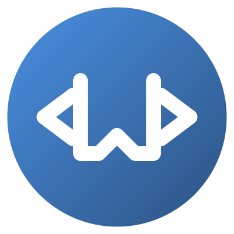

# LLM Code Bundler

  
  <h3>Bundle your code into a markdown file for LLM analysis</h3>

## Features

- Bundle multiple code files into a single markdown file
- Automatically excludes large files (configurable, default 100KB)
- Excludes common unnecessary directories (node_modules, dist, etc.)
- Supports all major programming languages
- Preserves file structure and syntax highlighting
- Creates LLM-friendly output format

## Usage

1. Open your project in VS Code
2. Press `Ctrl+Shift+P` (Windows/Linux) or `Cmd+Shift+P` (Mac)
3. Type "LLM: Bundle Code to Markdown"
4. The bundled code will be saved as `llm_bundle.md` in your workspace root

## Extension Settings

This extension contributes the following settings:

* `llm-code-bundler.maxFileSize`: Maximum file size in KB (default: 100)
* `llm-code-bundler.excludePatterns`: Patterns to exclude from bundling

## Default Exclude Patterns
- node_modules
- dist
- build
- .git
- *.min.*
- *.bundle.*

## Contributing

Feel free to submit issues and enhancement requests!

## License

[MIT](LICENSE)

## Author

[TheBitBrine](https://github.com/thebitbrine)